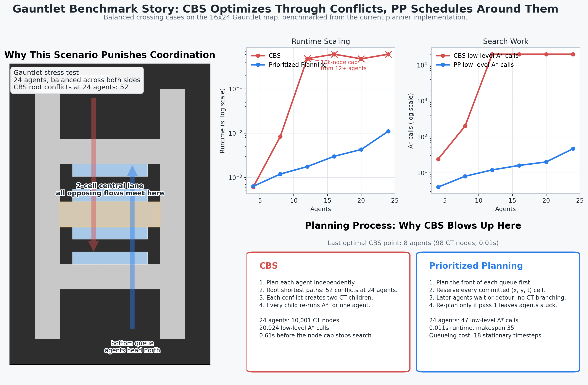

# Multi-Agent Autonomous Vehicle Parking Lot Planner

CMU 16-350 Final Project — Multi-agent path finding (MAPF) for autonomous vehicles in a parking lot.

---

## Project structure

```
final_project/
├── map/
│   ├── generate_map.py               # Generates the main parking lot map
│   ├── generate_gauntlet.py          # Generates the coordination-heavy Gauntlet map
│   ├── generate_two_lots.py          # Generates the Two Lots map (3 connecting roads)
│   ├── generate_two_lots_gauntlet.py # Generates the Two Lots Gauntlet (16-agent bottleneck)
│   ├── parking_lot.txt               # Main map (28×64, up to 144 agents)
│   ├── gauntlet.txt                  # Gauntlet map (16×24, up to 24 agents)
│   ├── two_lots.txt                  # Two Lots map (48×52, 16 agents default)
│   └── two_lots_gauntlet.txt         # Two Lots Gauntlet (30×26, 16 agents)
├── output/
│   ├── trajectories.txt     # Planner output (created by planner)
│   ├── map.png              # Static map image (created by visualizer)
│   └── result.gif           # Animated trajectories (created by visualizer)
├── docs/
│   ├── benchmark_story.png  # Composite benchmark/process visual for Gauntlet
│   └── benchmark_metrics.json # Raw metrics used by the benchmark visual
├── benchmark_story.py       # Reproducible benchmark + figure generator
├── planner.cpp              # CBS + Prioritized Planning in C++
├── checker.py               # Trajectory validity checker
├── visualizer.py            # Algorithm-agnostic Python visualizer
└── README.md
```

---

## Quick start

```bash
# 1. Build the planner (one-time)
g++ -O2 -std=c++17 -o planner planner.cpp

# 2. Generate a random 4-agent map and run CBS
python3 map/generate_map.py --random 4 --seed 42
./planner

# 3. Animate the result
python3 visualizer.py map/parking_lot.txt \
    --traj output/trajectories.txt --animate --save output/result.gif
```

---

## Step-by-step

### 1. Generate the map

```bash
# 4-agent fixed example (for CBS / quick testing)
python3 map/generate_map.py --example

# N agents with randomized starts and goals
python3 map/generate_map.py --random 8
python3 map/generate_map.py --random 8 --seed 42   # reproducible

# All 144 agents, deterministic ordering
python3 map/generate_map.py
```

All variants write `map/parking_lot.txt`.

**`generate_map.py` flags:**

| Flag | Description |
|------|-------------|
| `--example` | Fixed 4-agent test case (two left-entry, two right-entry) |
| `--random N` | N agents with randomly shuffled starts and goals (N ≤ 144) |
| `--seed K` | Integer seed for `--random` — same seed always produces the same map |
| *(none)* | All 144 agents, deterministic row-by-row ordering |

### 2. Build the planner

```bash
g++ -O2 -std=c++17 -o planner planner.cpp
```

### 3. Run the planner

```bash
# --- CBS (Conflict-Based Search) ---
# Optimal. Practical up to ~6 agents on this map.

./planner                                        # defaults: map/parking_lot.txt → output/trajectories.txt
./planner map/parking_lot.txt output/traj.txt    # explicit paths
./planner --max-agents 4                         # limit to first N agents

# --- Prioritized Planning (fast, non-optimal) ---
# Scales to ~16 agents reliably on this map.

./planner --pp                                   # all agents in map file
./planner --pp --max-agents 16                   # first 16 agents
```

**Flags:**

| Flag | Description |
|------|-------------|
| `--pp` | Use Prioritized Planning instead of CBS |
| `--max-agents N` | Load only the first N agents from the map file |
| *(positional 1)* | Map file path (default: `map/parking_lot.txt`) |
| *(positional 2)* | Output trajectory path (default: `output/trajectories.txt`) |

Each run also ends with a machine-readable `STAT ...` line containing runtime,
makespan, low-level A* calls, and CBS node/conflict counts.  The benchmark
visual below is generated directly from those stats.

### 4. Visualize

```bash
# Static map image — shows grid, agent starts (triangles) and goals (stars)
python3 visualizer.py map/parking_lot.txt --save output/map.png

# Animate trajectories from the planner
python3 visualizer.py map/parking_lot.txt \
    --traj output/trajectories.txt \
    --animate \
    --save output/result.gif

# Display in a window instead of saving (omit --save)
python3 visualizer.py map/parking_lot.txt --traj output/trajectories.txt --animate

# Hide agent markers on the static view
python3 visualizer.py map/parking_lot.txt --no-agents --save output/map_clean.png

# Control animation speed (default 5 fps)
python3 visualizer.py map/parking_lot.txt \
    --traj output/trajectories.txt --animate --fps 10 --save output/result.gif

# Save as MP4 instead of GIF (requires ffmpeg)
python3 visualizer.py map/parking_lot.txt \
    --traj output/trajectories.txt --animate --save output/result.mp4
```

**Visualizer flags:**

| Flag | Description |
|------|-------------|
| `map` | (required) path to the map file |
| `--traj FILE` | Trajectory file to overlay |
| `--animate` | Animate (requires `--traj`) |
| `--save FILE` | Save to file (`.png`, `.gif`, or `.mp4`) |
| `--fps N` | Frames per second for animation (default 5) |
| `--no-agents` | Hide start/goal markers on static view |

### 5. Generate the benchmark/process visual

```bash
# Benchmark balanced Gauntlet crossing cases and render the composite figure
# (builds a temporary planner from planner.cpp when needed)
python3 benchmark_story.py
```

Outputs:

- `docs/benchmark_story.png` — composite visual with the Gauntlet bottleneck,
  runtime/search scaling, and a side-by-side CBS vs PP planning-process story.
- `docs/benchmark_metrics.json` — raw benchmark numbers used to render the
  figure.

Why this visual is useful: it benchmarks balanced Gauntlet instances from
4→24 agents, where all agents must traverse the same 2-cell central lane in
opposite directions.  That shared bottleneck creates many simultaneous root
conflicts for CBS, which then explodes into repeated constraint-tree branches
and low-level replans.  Prioritized Planning handles the same pressure by
turning it into queueing and reservations instead of search branching.



---

## Recommended workflows

### Test CBS on 4 agents (main map)

```bash
python3 map/generate_map.py --example
./planner
python3 visualizer.py map/parking_lot.txt \
    --traj output/trajectories.txt --animate --save output/result.gif
```

### Run Prioritized Planning on 50 agents (main map)

```bash
python3 map/generate_map.py --random 50 --seed 42
./planner --pp
python3 visualizer.py map/parking_lot.txt \
    --traj output/trajectories.txt --animate --save output/result.gif
```

### Gauntlet — CBS on 8 agents (bidirectional, coordination-heavy)

```bash
python3 map/generate_gauntlet.py --example
./planner map/gauntlet.txt output/gauntlet.txt
python3 checker.py map/gauntlet.txt output/gauntlet.txt
python3 visualizer.py map/gauntlet.txt \
    --traj output/gauntlet.txt --animate --save output/gauntlet.gif
```

### Gauntlet — PP on all 24 crossing agents

```bash
python3 map/generate_gauntlet.py
./planner --pp map/gauntlet.txt output/gauntlet.txt
python3 checker.py map/gauntlet.txt output/gauntlet.txt
```

### Two Lots — PP on 16 crossing agents

8 agents start in the left lot with goals in the right lot; 8 do the reverse.
All must cross one of three roads connecting the lots.

```bash
python3 map/generate_two_lots.py
./planner --pp map/two_lots.txt output/two_lots.txt
python3 checker.py map/two_lots.txt output/two_lots.txt
python3 visualizer.py map/two_lots.txt \
    --traj output/two_lots.txt --animate --save output/two_lots.gif
```

### Two Lots Gauntlet — PP on 16 agents (brutal 2-cell bottleneck)

Same crossing scenario on a compact 30×26 map where the only short routes are
2 cells wide. Agents heading in opposite directions can barely squeeze past each
other, guaranteeing heavy coordination load.

```bash
python3 map/generate_two_lots_gauntlet.py
./planner --pp map/two_lots_gauntlet.txt output/two_lots_gauntlet.txt
python3 checker.py map/two_lots_gauntlet.txt output/two_lots_gauntlet.txt
python3 visualizer.py map/two_lots_gauntlet.txt \
    --traj output/two_lots_gauntlet.txt --animate --save output/two_lots_gauntlet.gif
```

### View just the map

```bash
python3 map/generate_map.py --example
python3 visualizer.py map/parking_lot.txt --save output/map.png
```

---

## Map format

`map/parking_lot.txt` — a custom text format:

```
N
28,64          ← grid width, height
C
100            ← collision threshold (cells >= this value are walls)
A
4              ← number of agents
2,63,N         ← agent 0 start: x, y, heading  (N/S/E/W)
6,6,1          ← agent 0 goal:  x, y, heading (optional)
3,63,N         ← agent 1 start
10,6,3         ← agent 1 goal
...
M
100,100,...    ← row y=0 (x = 0..27)
...            ← row y=1 ... row y=63
```

**Cell values:** `0` = road, `1` = parking spot, `100` = wall/impassable.

**Heading values:** `0`/`E` = East, `1`/`N` = North, `2`/`W` = West, `3`/`S` = South.

Goal headings are optional. If a goal heading is omitted and the goal is a
parking spot, the planner and checker infer the required parked heading from
the adjacent separator wall, so cars finish facing into the wall by default.

### Map layout (28 × 64 grid)

```
y=63  ┌─────────────────────────┐
      │  outer wall             │
y=28  │  perimeter queue area   │  ← x=2-3 and x=24-25 are ROAD
y=24  │  interior top wall      │
y=22  │──── lane 4 (y=22-23) ──│
y=21  │  parking row H          │
y=20  │  divider wall           │
y=19  │  parking row G          │
y=17  │──── lane 3 (y=17-18) ──│
y=16  │  parking row F          │
y=15  │  divider wall           │
y=14  │  parking row E          │
y=12  │──── lane 2 (y=12-13) ──│
y=11  │  parking row D          │
y=10  │  divider wall           │
y= 9  │  parking row C          │
y= 7  │──── lane 1 (y=7-8) ────│
y= 6  │  parking row B          │
y= 5  │  divider wall           │
y= 4  │  parking row A          │
y= 2  │──── access road (y=2-3)│
y= 0  └─────────────────────────┘
       x=0-1 wall  x=2-3 left perim  x=5-22 spots  x=24-25 right perim
```

8 parking rows × 18 spots each = **144 spots total**.
Agents enter from the top corners and navigate to their assigned spot.

---

## Gauntlet map (16 × 24)

`map/gauntlet.txt` — a smaller, coordination-heavy map designed to stress-test planners.

```
y=23  ┌──────────────┐
      │  outer wall  │
y=21  │  top queue   │  ← agents start here heading South
y=18  │              │
y=17  │ top access   │  ← x=2-13, 2-wide road
y=15  │  row D ══════│
y=14  │  ─ divider ─ │
y=13  │  row C ══════│
y=12  │ central lane │  ← 2-wide BOTTLENECK (all agents cross here)
y=11  │              │
y=10  │  row B ══════│
y= 9  │  ─ divider ─ │
y= 8  │  row A ══════│
y= 7  │ bottom access│  ← x=2-13, 2-wide road
y= 5  │ bottom queue │  ← agents start here heading North
y= 2  │              │
y= 0  └──────────────┘
       x=0 .. x=15
```

**What makes it hard:** top agents are assigned spots in the *bottom* half (rows A & B) and bottom agents are assigned spots in the *top* half (rows C & D). Every single agent must cross the 2-wide central lane in *opposite directions*, producing unavoidable head-on conflicts.

| Mode | Agents | CBS nodes | Result |
|------|--------|-----------|--------|
| `--example` | 8 | ~160 | optimal |
| all crossing | 24 | >10,000 (node limit) | use `--pp` |

---

## Two Lots map (48 × 52)

`map/two_lots.txt` — two mirror-image parking lots side-by-side, separated by a
wall with three openings.  Agents assigned to the opposite lot must negotiate
one of the three roads.

```
y=37  ████████████████████████████████████████████████ (outer wall)
y=34  ██ ══════════════ Road 3 bypass (x=2–45) ═════ ██  ← long detour
y=33  same
y=23  ██ top access   │WALL│ top access ██
y=21  ██ row H        │WALL│ row H      ██
      ...
y=18  ██ ══════════════════ Road 2 (y=17–18) ═══════ ██  ← 4-wide bottleneck
y=17  same
      ...
y= 8  ██ ══════════════════ Road 1 (y=7–8)  ═══════ ██  ← 4-wide bottleneck
y= 7  same
      ...
y= 4  ██ row A        │WALL│ row A      ██
y= 2  ██ bottom access│WALL│ bottom acc ██
y= 0  ████████████████████████████████████████████████

       x=0  2   4        19  20   22 25  26  28       43  44  46  47
            per div 14sp div perim ROAD perim div 14sp div  perim wall
                     LEFT LOT      ←roads→    RIGHT LOT
```

8 parking rows × 14 spots = **112 spots per lot, 224 total**.

**Three roads:**

| Road | y-rows | x-columns | Length | Notes |
|------|--------|-----------|--------|-------|
| Road 1 | 7–8 | 22–25 | 4 cells wide | Short — upper bottleneck |
| Road 2 | 17–18 | 22–25 | 4 cells wide | Short — lower bottleneck |
| Road 3 | 33–34 | 2–45 | full width | Long bypass via top perimeter |

**`generate_two_lots.py` flags:**

| Flag | Description |
|------|-------------|
| `--n N` | Agents per side for crossing scenario (default 8, total 16) |
| `--random N` | N agents with random starts and goals |
| `--seed K` | Random seed |

---

## Two Lots Gauntlet map (30 × 26)

`map/two_lots_gauntlet.txt` — compact version of Two Lots for 16 agents.
The two bottleneck roads are only **2 cells wide**, meaning at most 2 agents
(one per lane) can cross simultaneously in opposite directions.

```
y=25  ██████████████████████████████ (outer wall)
y=22  ██ ════ Road 3 bypass ═════ ██  (x=2–27, long detour)
y=21  same
y=19  ██ [queue]  │WALL│ [queue] ██   ← agents start here
y=17  ██ top acc  │WALL│ top acc ██
y=16  ██ row E    │WALL│ row E   ██
y=14  ██ ═══ Road 2 (y=13–14) ═══ ██  ← 2-cell bottleneck
y=13  same
y=12  ██ row D    │WALL│ row D   ██
y=10  ██ row C    │WALL│ row C   ██
y= 8  ██ ═══ Road 1 (y=7–8)  ═══ ██  ← 2-cell bottleneck
y= 7  same
y= 6  ██ row B    │WALL│ row B   ██
y= 4  ██ row A    │WALL│ row A   ██
y= 2  ██ btm acc  │WALL│ btm acc ██
y= 0  ██████████████████████████████

       x=0  2   4  5    10 11 12 13 14 15 16 17 18  19    24 25 26 27 28 29
            per div 6sp div perim ←2→  perim div 6sp div  perim wall
                    LEFT LOT    roads   RIGHT LOT
```

5 parking rows × 6 spots = **30 spots per lot, 60 total**.
16 agents (8 per side) all assigned to the opposite lot.

**What makes it hard:** roads are only 2 cells wide (x=14–15), forcing agents
to queue.  With 8 agents competing for each short road, waits are unavoidable.
Road 3 avoids the pinch but costs ~30 extra steps.

**`generate_two_lots_gauntlet.py` flags:**

| Flag | Description |
|------|-------------|
| `--random N` | N agents with random starts/goals (max 16) |
| `--seed K` | Random seed |
| *(none)* | Fixed 16-agent gauntlet layout |

---

## Trajectory format

`output/trajectories.txt` — one line per (agent, timestep):

```
# agent_id,timestep,x,y,heading  (0=E 1=N 2=W 3=S)
0,0,2,63,1
0,1,2,62,1
0,2,2,61,1
...
1,0,3,63,1
...
```

The heading column is optional; the visualizer accepts files with or without it.

---

## Motion model

Each agent has state `(x, y, heading)`. Forward, backward, and wait consume
one timestep. A left/right turn is a single control choice, but it executes as
a 2-timestep maneuver with an intermediate forward state:

| Action | Effect |
|--------|--------|
| `FORWARD` | Move +1 cell in heading direction |
| `BACKWARD` | Move −1 cell in heading direction |
| `TURN_LEFT` | `t→t+1`: move forward one cell. `t+1→t+2`: move into the forward-left cell and update heading left |
| `TURN_RIGHT` | `t→t+1`: move forward one cell. `t+1→t+2`: move into the forward-right cell and update heading right |
| `WAIT` | No change |

Parking completion is pose-based: the agent must reach the goal cell with the
required final heading. For parking spots, that heading defaults to the
separator-wall-facing direction if the map file does not specify one.

---

## Algorithms

### Conflict-Based Search (CBS)

Two-level search:
- **High level:** Maintains a constraint tree (CT). Each CT node has a set of constraints and a set of paths (one per agent). Expands the lowest-cost node, finds the first conflict, and branches into two children by adding a constraint for one agent at a time.
- **Low level:** Single-agent space-time A\* with `(x, y, heading, t)` state, using a precomputed BFS heuristic (ignoring heading and constraints) for admissible guidance.

**Conflict types:**
- *Vertex conflict:* two agents at the same `(x, y)` at the same time `t`.
- *Edge (swap) conflict:* two agents swap cells between `t` and `t+1`.

**Complexity:** optimal but exponential in the number of conflicts. Practical for ~4–6 agents on this map; a node limit of 10,000 CT nodes prevents runaway searches.

### Prioritized Planning (PP)

Plans agents one at a time in priority order. Previously planned agents' reserved `(x, y, t)` cells become hard constraints for all subsequent agents. Each agent runs space-time A\* against the current reservation table.

**Priority ordering:** agents with the longest unconstrained path (BFS distance from start to goal) are planned first, so the most-constrained agents get the most freedom.

**Trade-offs:** fast, not optimal, not complete (can fail to find a path for some agents even when one exists). Works reliably for ~16 agents on this map.

---

## Dependencies

```bash
pip install numpy matplotlib
```

C++ compiler with C++17 support (tested with `g++ 14`).
# multi-agent-planning
